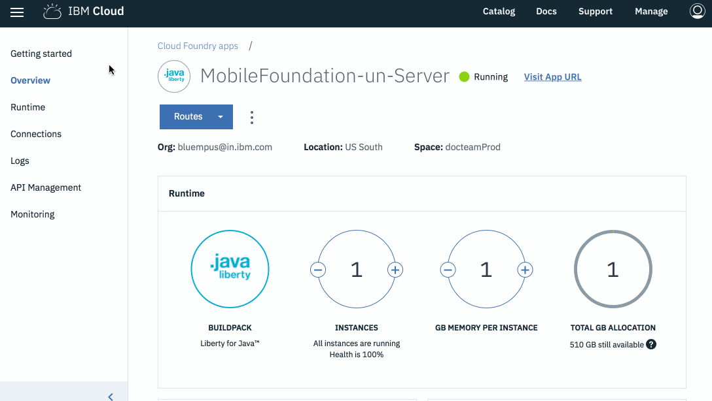

---

copyright:
  years: 2019
lastupdated: "2019-07-03"

keywords: mobile foundation, logging and tracing, accessing server logs, logging, tracing

subcollection:  mobilefoundation

---

{:new_window: target="_blank"}
{:shortdesc: .shortdesc}
{:screen:.screen}
{:codeblock:.codeblock}
{:pre: .pre}
{:tip: .tip}
{:note: .note}

# Logging and tracing
{: #logging-and-tracing}

{{site.data.keyword.mobilefoundation_long}} helps you to with logging and tracing of your app. This section explains how to familiarize yourself for logging and tracing of your app. 
{: shortdesc}

## Accessing server logs
{: #accessing-server-logs }

To access server logs, go through the following scenario:

### Scenario 1
{: #scenario-1}

To manage the IBM Cloud Cloud Foundry app and execute the following commands, you need to have the [IBM Cloud Command Line Tool](https://github.com/cloudfoundry/cli/releases) installed. Download and install the IBM Cloud CLI.
{: Note}

1. To view the recent logs, open the terminal session and execute the following command:
    ```bash
    ibmcloud cf logs <appname> –-recent
    ```
    {: codeblock}
    
    where *<appname>* is the application name.

    For example: `ibmcloud cf logs mobilefoundation-serverapp –-recent`

2. Open the terminal and Log in to the Cloud Foundry Application instance of your *Organization* and *Space*.
    ```bash
    ibmcloud cf ssh <appname> [ -i instance_index ]
    ```
    {: codeblock}

    where *<appname>* is the application name.

    For example: `ibmcloud cf ssh mfpserver –i 0`
    
3. Navigate to logs directory:
    ```bash
    cd logs
    ```
    {: codeblock}
 
    You should be able to see the following log files:
    ``` 
    ./message-*.log
    ./ffdc/
    ```

4. Copy the logs from the Cloud Foundry Application to your local machine:
    ```bash
    ibmcloud cf ssh <appname> -i 0 -c “cat /home/vcap/logs/file-name” > ./file-name
    ```
    {: codeblock}

    For example, *ibmcloud cf ssh <appname> -i 0 -c “cat /home/vcap/logs/message.log” > ./message.log*

5. Only if trace is enabled, execute the following command:
    ```bash
    cf ssh <mfp_Appname> -c "/bin/cat logs/trace.log" > trace.log
    ```
    {: codeblock}

### Scenario 2
{: #scenario-2}

You can access the logs through IBM Cloud console. 

1. Login to [https://cloud.ibm.com/](https://cloud.ibm.com/).
2. On the IBM Cloud dashboard, navigate to **Cloud Foundry Apps** and Select your app.
3. Click on your app's entry to open the details, and then go to **Logs**. Current logs are shown with the most recent at the bottom. On the upper right, you can search for an entry or filter by log type. Select **Application (APP)**.
4. Select your App and click on **Logs → View in Kibana**.
5. Select and copy the logs messages.


## Tracing
{: #tracing }
To enable tracing in Mobile Foundation Cloud Foundry App, in order to view DEBUG-level messages in the **trace.log** file:

1. Log in to the Cloud Foundry application instance that the Mobile Foundation service instance has created:
    ```
    ibmcloud cf ssh <appname> [-i instance_index ]
    ```
    {: codeblock}
2. Go to each instance in the console and open the file `/home/vcap/app/wlp/usr/servers/mfp/configDropins/overrides/tracespec.xml` using the vi editor.
3. Update the following trace statement: `traceSpecification="=info:com.ibm.mfp.*=all"` and save the file.

The `server.xml` or `tracespec.xml` change will be lost on a restage or restart. It is only valid for the instance you `ssh` into, so you have to enable traces on all the instances of your application.
{: note}

The **trace.log** file is now available in the above specified location.



